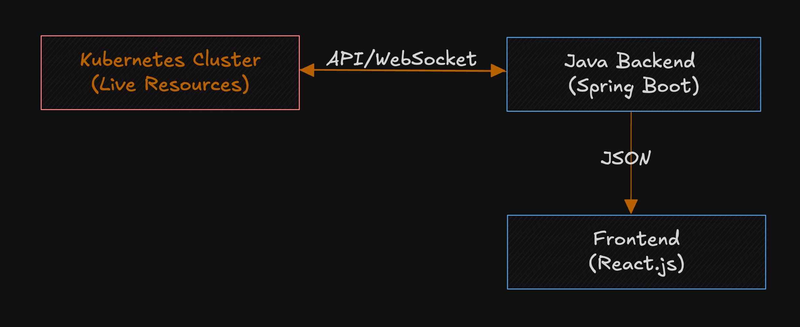

# 🚀 Live Kubernetes Mapping Tool

_Visualize your Kubernetes apps in real time — see what’s running, how it connects, and where it’s breaking._

---

## 📘 Overview

The Live Kubernetes Mapping Tool provides a **real-time, animated map of your applications and infrastructure** running inside a Kubernetes cluster. It’s a developer-first tool that turns complex deployments into a visual, interactive graph with insights into the relationships between workloads, services, ingress routes, and configurations.

---

## 🏗️ System Architecture



---

## ⚙️ Core Flow

### 1. Kubernetes Watcher (Java Backend)

- Uses **Fabric8** or **official Java K8s client**
- Watches changes in:
  - Deployments, Pods, ReplicaSets
  - Services, Ingresses
  - ConfigMaps, Secrets, Volumes
- Builds in-memory topology grouped by namespace or application label.

**Sample Output JSON:**
```json
{"namespaces":{"default":{"nodes":[{"id":"service:dc675f13-6c8e-455f-bbe4-2aceaf3ecbac","name":"kubernetes","namespace":"default","type":"SERVICE"}],"edges":[]},"ingress-nginx":{"nodes":[{"id":"pod:c2ddd532-7d5a-49d3-ba46-7ef6f3592e6d","name":"ingress-nginx-admission-create-qcjfq","namespace":"ingress-nginx","type":"POD"},{"id":"replicaset:a78d9428-25a9-413d-bf4d-496a8290377a","name":"ingress-nginx-controller-67c5cb88f","namespace":"ingress-nginx","type":"REPLICASET"},{"id":"pod:565f5857-2146-4d54-ae8f-8456a83e8332","name":"ingress-nginx-admission-patch-2wh4p","namespace":"ingress-nginx","type":"POD"},{"id":"service:8d399466-14bd-4df1-b596-61d77b03c003","name":"ingress-nginx-controller-admission","namespace":"ingress-nginx","type":"SERVICE"},{"id":"service:0d386628-7f6e-44da-92ad-82464f37c035","name":"ingress-nginx-controller","namespace":"ingress-nginx","type":"SERVICE"},{"id":"pod:0f6bdef0-0e10-49fa-b0e5-ee9b977b8033","name":"ingress-nginx-controller-67c5cb88f-g7zpz","namespace":"ingress-nginx","type":"POD"},{"id":"deployment:5ba15d55-cb37-4dd4-bdfe-c04e2bee0236","name":"ingress-nginx-controller","namespace":"ingress-nginx","type":"DEPLOYMENT"}],"edges":[{"fromId":"service:0d386628-7f6e-44da-92ad-82464f37c035","toId":"pod:0f6bdef0-0e10-49fa-b0e5-ee9b977b8033"},{"fromId":"service:8d399466-14bd-4df1-b596-61d77b03c003","toId":"pod:0f6bdef0-0e10-49fa-b0e5-ee9b977b8033"},{"fromId":"deployment:5ba15d55-cb37-4dd4-bdfe-c04e2bee0236","toId":"replicaset:a78d9428-25a9-413d-bf4d-496a8290377a"},{"fromId":"replicaset:a78d9428-25a9-413d-bf4d-496a8290377a","toId":"pod:0f6bdef0-0e10-49fa-b0e5-ee9b977b8033"}]},"wordpress":{"nodes":[{"id":"replicaset:44e32ade-1003-44c5-8358-0eff92cd95b2","name":"my-wordpress-6db6f7bf7c","namespace":"wordpress","type":"REPLICASET"},{"id":"pod:b1a57ff6-c5cb-4028-83d6-27558594a1ec","name":"my-wordpress-mariadb-0","namespace":"wordpress","type":"POD"},{"id":"deployment:4b3dfba5-df7e-4579-ac46-3469db97ba1d","name":"my-wordpress","namespace":"wordpress","type":"DEPLOYMENT"},{"id":"pod:d402cf88-1408-473f-bee3-c6b340b1c351","name":"my-wordpress-6db6f7bf7c-8n9lg","namespace":"wordpress","type":"POD"},{"id":"service:23c11451-5b5b-4625-acfe-173c701489c7","name":"my-wordpress-mariadb","namespace":"wordpress","type":"SERVICE"},{"id":"service:5e48c741-06d1-45be-bc0b-f24f4417b0e6","name":"my-wordpress-mariadb-headless","namespace":"wordpress","type":"SERVICE"},{"id":"service:d29427d2-c7eb-4806-9059-c79b6821b4cc","name":"my-wordpress","namespace":"wordpress","type":"SERVICE"}],"edges":[{"fromId":"service:5e48c741-06d1-45be-bc0b-f24f4417b0e6","toId":"pod:b1a57ff6-c5cb-4028-83d6-27558594a1ec"},{"fromId":"service:d29427d2-c7eb-4806-9059-c79b6821b4cc","toId":"pod:d402cf88-1408-473f-bee3-c6b340b1c351"},{"fromId":"service:23c11451-5b5b-4625-acfe-173c701489c7","toId":"pod:b1a57ff6-c5cb-4028-83d6-27558594a1ec"},{"fromId":"deployment:4b3dfba5-df7e-4579-ac46-3469db97ba1d","toId":"replicaset:44e32ade-1003-44c5-8358-0eff92cd95b2"},{"fromId":"replicaset:44e32ade-1003-44c5-8358-0eff92cd95b2","toId":"pod:d402cf88-1408-473f-bee3-c6b340b1c351"}]},"kube-system":{"nodes":[{"id":"pod:85ef6f89-8a1c-4381-9f49-f0e1f37cb7ce","name":"kube-proxy-xwjn7","namespace":"kube-system","type":"POD"},{"id":"pod:bde7ffea-d0a1-40df-9aaa-4289e4bb3c5f","name":"storage-provisioner","namespace":"kube-system","type":"POD"},{"id":"pod:b4db2c34-1ec1-49da-a13e-ebb75e3f2dda","name":"kube-scheduler-minikube","namespace":"kube-system","type":"POD"},{"id":"service:3d1bb613-154b-4ce4-9f0f-908b5a0d1d33","name":"kube-dns","namespace":"kube-system","type":"SERVICE"},{"id":"pod:37714b16-d452-45eb-9c33-63b6cf29b912","name":"etcd-minikube","namespace":"kube-system","type":"POD"},{"id":"pod:e7c49307-7fb4-4cdc-999a-d0df65f4e801","name":"coredns-674b8bbfcf-wvf87","namespace":"kube-system","type":"POD"},{"id":"pod:4f273959-a415-4548-a83c-84c72298ebf4","name":"kube-controller-manager-minikube","namespace":"kube-system","type":"POD"},{"id":"replicaset:6fb723d7-8be8-4b7d-8c27-c977e6838714","name":"coredns-674b8bbfcf","namespace":"kube-system","type":"REPLICASET"},{"id":"pod:4cd83df5-b4af-42f2-aad8-29173c835a3e","name":"kube-apiserver-minikube","namespace":"kube-system","type":"POD"},{"id":"deployment:f8a49569-c843-4e95-8b35-cf4300c44762","name":"coredns","namespace":"kube-system","type":"DEPLOYMENT"}],"edges":[{"fromId":"service:3d1bb613-154b-4ce4-9f0f-908b5a0d1d33","toId":"pod:e7c49307-7fb4-4cdc-999a-d0df65f4e801"},{"fromId":"deployment:f8a49569-c843-4e95-8b35-cf4300c44762","toId":"replicaset:6fb723d7-8be8-4b7d-8c27-c977e6838714"},{"fromId":"replicaset:6fb723d7-8be8-4b7d-8c27-c977e6838714","toId":"pod:e7c49307-7fb4-4cdc-999a-d0df65f4e801"}]}}}
```

### 2. Animated Frontend UI

- Fetches initial topology via REST
- Connects to live updates via WebSocket
- Uses **Cytoscape.js**, **Reaflow**, or **Vis.js** for rendering animated DAG/graph
- Animates:
  - Pod creation/removal
  - Service routing lines
  - Config/Secret mounts appearing/disappearing
  - Status changes

---

## 🧑‍💻 Developer Interactions

- **Click Node** → Show metadata, mounted configs, pod logs
- **Hover** → Tooltip with labels/status
- **Filters**:
  - Namespace
  - Label selector
  - Resource type
- **Legend** for colors, edge types (traffic, mount)

---

## 🧩 Bonus Features

### ✅ 1. Export as Image or Diagram
- SVG, PNG, PDF exports
- Markdown Mermaid export for GitHub READMEs

### 🕒 2. Cluster Time Machine
- Record/replay cluster state
- Timeline slider with animations

### 🔍 3. Search and Inspector
- Search by pod name, config, label
- Inspector shows YAML, metrics, related logs/events

### 🧩 4. Plugin System
- Extendable with custom plugins:
  - Annotations
  - Metrics overlays
  - Tracing links

### 📦 5. Embeddable Dashboard
- Can be used standalone or inside:
  - Grafana
  - Backstage
  - Custom portals

---

## 🔌 APIs & Endpoints

### REST
```http
GET /api/topology?namespace=prod
GET /api/apps/:name/details
```

### WebSocket
```ws
/ws/topology/stream
```
Pushes JSON deltas:
```json
{
  "event": "POD_ADDED",
  "data": {
    "pod": "user-xyz",
    "status": "Running"
  }
}
```

---

## 🧱 Tech Stack

| Layer       | Technology                         |
|-------------|------------------------------------|
| Backend     | Java, Spring Boot or Quarkus       |
| K8s Client  | Fabric8 Kubernetes Client          |
| Frontend    | React (or Svelte/Vue)              |
| Animation   | Cytoscape.js / Reaflow / Vis.js    |
| Styling     | Tailwind CSS / Chakra UI           |
| Comm Layer  | REST + WebSocket                   |
| Deployment  | Docker, Helm, Kubernetes           |

---

## 🚀 Future Ideas

- GitOps integration
- Live linting of topology
- AI assistant for suggestions and troubleshooting
